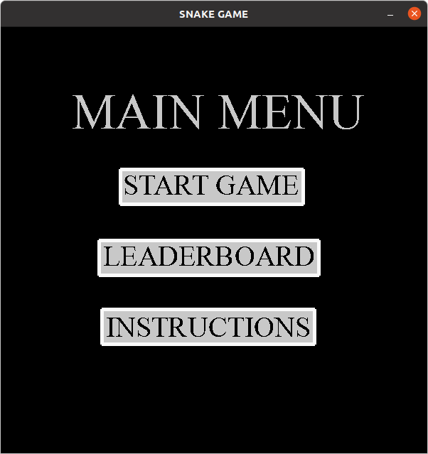
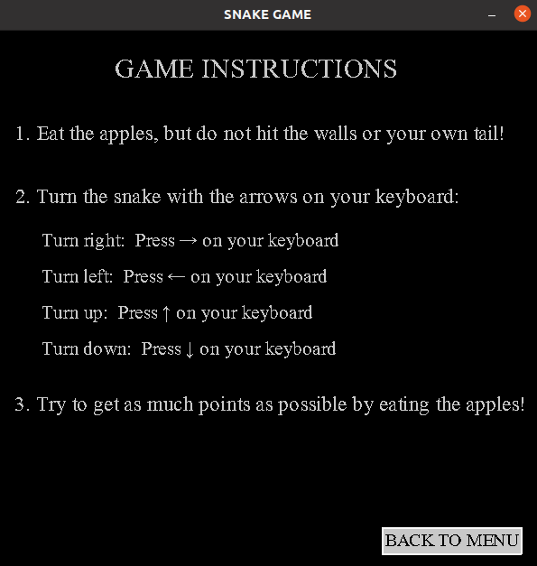
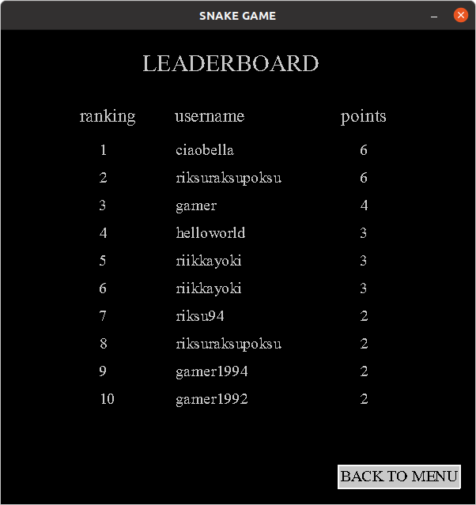
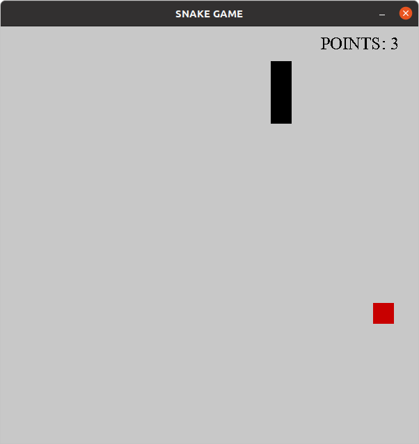
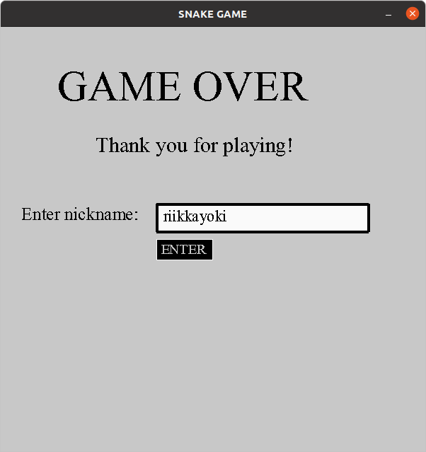

# Käyttöohje


Voit ladata harjoitustyön lähdekoodin [täältä](https://github.com/riikkayoki/ot-harjoitustyo/releases/tag/finalproject).

## Ohjelman käynnistäminen

Asenna riippuvuudet komennolla:

```
poetry install
```

Suorita alustustoimenpiteet komennolla:

```
poetry run invoke build
```

Käynnistä komennolla:

```
poetry run invoke start
```

## Pelin aloittaminen

Sovellus käyynistyy päävalikkonäkymään:



Lue ensin pelin käyttöohjeet painamalla 'INSTRUCTIONS' -nappia tietokoneesi hiirellä.
Pääset takaisin päävalikkoon painamalla 'BACK TO MENU' -nappia tietokoneesi hiirellä:



Katso top 10 pelaajien tuloksia painamalla 'LEADERBOARD' -nappia päävalikosta tietokoneesi hiirellä. 
Pääset takaisin painamalla BACK TO MENU -nappia tietokoneesi hiirellä:



Voit aloittaa pelin painamalla päävalikosta nappia 'START' tietokoneesi hiirellä. 
Pelaa peliä 'INSTRUCTIONS' -valikossa olleiden käyttöohjeiden mukaisesti.



Kun peli loppuu, paina tekstiruutua ja kirjoita nimimerkkisi siihen tietokoneesi näppäimillä. 
Paina tämän jälkeen 'enter' -nappia, jotta pääset takaisin päävalikkoon. 


