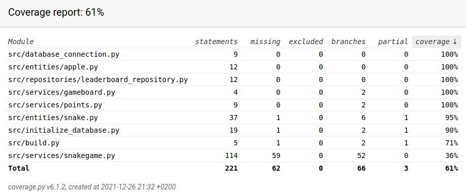

# Testausdokumentti

Ohjelmaa on testattu unittestin avulla automatisoiduilla yksikkö- ja integraatiotesteiillä sekä manuaalisesti järjestelmätason testeillä.

## Yksikkö- ja integraatiotestaus

### Sovelluslogiikka

Kukin sovelluslogiikasta vastaava luokka on testattu omassa luokassaan. 

#### TestSnake -luokka

`Snake` -luokka on testattu `TestSnake` -luokassa. 
Löydät testaustiedoston [täältä](https://github.com/riikkayoki/ot-harjoitustyo/blob/master/harjoitustyo/src/tests/entities/snake_test.py).

- Testaa, että mato kääntyy, liikkuu ja kasvaa oikein. 
- Testaa tunnistaako ohjelma milloin mato osuu seinään ja itseensä. 
- Testaa, että mato nollaantuu oikein.

#### TestApple -luokka

`Apple` -luokka on testattu TestApple -luokassa. 
Löydät testaustiedoston [täältä](https://github.com/riikkayoki/ot-harjoitustyo/blob/master/harjoitustyo/src/tests/entities/apple_test.py).

- Testaa, että omenalle luodaan satunnainen sijainti. 

#### TestSnakeGame:

`SnakeGame` -luokka on testattu `TestSnakeGame` -luokassa. 
Löydät testaustiedoston [täältä](https://github.com/riikkayoki/ot-harjoitustyo/blob/master/harjoitustyo/src/tests/services/game_test.py).

- Testaa, että pisteet päivittyvät oikein.

#### TestGameBoard 

`GameBoard` -luokka on testattu `TestGameBoard` -luokassa. 
Löydät testaustiedoston [täältä](https://github.com/riikkayoki/ot-harjoitustyo/blob/master/harjoitustyo/src/tests/services/gameboard_test.py).

- Testaa, että pelilauta saa oikeat mittasuhteet.

#### TestPoints

`Points` -luokka on testattu `TestPoints` -luokassa. 
Löydät testaustiedoston [täältä](https://github.com/riikkayoki/ot-harjoitustyo/blob/master/harjoitustyo/src/tests/services/points_test.py).

- Testaa, että pisteet lisääntyvät, päivittyvät ja nollaantuvat oikein. 

### Repositorio -luokka

Tietojen pysyväistallennuksesta vastaava `LeaderboardRepository` -luokka on testattu `TestLeaderboardRepository` -luokassa. 
Tässä luokassa on testattu myös tiedostot 
[database_connetion.py](https://github.com/riikkayoki/ot-harjoitustyo/blob/master/harjoitustyo/src/database_connection.py) 
ja [initialize_database.py](https://github.com/riikkayoki/ot-harjoitustyo/blob/master/harjoitustyo/src/initialize_database.py)

Löydät testaustiedoston [täältä](https://github.com/riikkayoki/ot-harjoitustyo/blob/master/harjoitustyo/src/tests/repositories/leaderboard_repository_test.py).

- Testaa tekaistulla tietokannalla (vastaa oikeaa tietokantaa), 
että tietokannasa voidaan sekä hakea tietoja että sinne voidaan lisätä tietoja.

### Testauskattavuus

Testauksen haarautumiskattavuus on 61%.

Testauksen ulkopuolelle on jätetty ui -hakemiston tiedostot sekä service hakemistossa löytyvä renderer.py ja clock.py, 
koska nämä pyörittävät ainoastaan pygame tapahtumia. 

## Järjestelmätestaus

Sovelluksen järjestelmätestaus on suoritettu manuaalisesti.

### Asennus ja konfigurointi

Sovellus on haettu ja sitä on testattu [käyttöohjeen](https://github.com/riikkayoki/ot-harjoitustyo/blob/master/dokumentaatio/kayttoohje.md) kuvaamalla tavalla Linux-ympäristössä.

### Toiminnallisuudet

Kaikki [vaatimusmäärittelydokumentin](https://github.com/riikkayoki/ot-harjoitustyo/blob/master/dokumentaatio/vaativuusmaarittely.md) ja käyttöohjeen listaamat toiminnallisuudet on käyty läpi. 
Sovellusta on testattu eri tietokantojen nimillä sekä erilaisilla syötteillä näppäimistön ja hiiren avulla ohjelman ollessa käynnissä.

## Sovellukseen jääneet laatuongelmat

Luokan `SnakeGame `ongelmallisesta rakenteesta johtuen testauksen haarautumiskattavuus laskee 95:stä prosentista 61 -prosenttiin.

