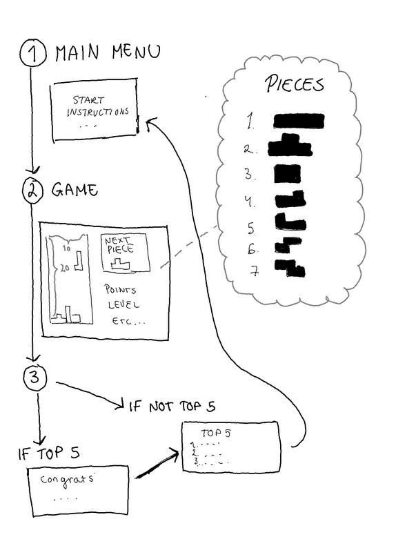

# Vaatimusmäärittely 
_____________________

## Sovelluksen tarkoitus

--------------------------------------

Sovellus on versio perinteisestä Tetris -pelistä. 

## Käyttäjät
_______________________________________________________

Tässä sovelluksessa on vain yhden tyyppisiä käyttäjiä eli pelaajia.

## Käyttöliittymä luonnos
________________________________

Sovelluksen käyttöliittymä muodostuu neljästä erilaisesta komponentista:

1. *Päävalikko*: Kun peli avataan, tulee käyttäjälle näkyviin päävalikko. Päävalikosta pystyy katsomaan ohjeet ja aloittamaan pelin. 
Painaessaan 'Start' -nappia, peli käynnistyy. 

2. *Peliruudukko*: peliruudussa on näkyvissä itse peli, seuraava putoava pala sekä pisteet että taso.

3. *Onnittelut ja nimimerkin lisääminen*: Mikäli pelaaja oli pistemäärältään top 5 pelaajan joukossa, päätyy hän valikkoon, jossa häntä onnitellaan. 
Tämän lisäksi hänen tulee syöttää nimimerkkinsä ruutuun ja lähettään tämän eteenpäin.

4. *Top 5 -näkymä*: Päädymme tähän 3. komponentin jälkeen tai mikäli käyttäjä ei ollut top 5 pelaajan joukossa.
Tässä valikossa käyttäjä lisää ruutuun nimimerkkinsä ja lähettää sen eteenpäin.
Tämän jälkeen käyttäjä päätyy top5 valikkoon, jossa näkyy hännen nimensä.
Päädymme tämän valikon jälkeen taas päävalikkoon.

## Perusversion tarjoama toiminnallisuus
___________________________________
 * Pelissä on 7 erilaista palaa. 
   * Kullakin palalla on oma värinsä.

 * Paloja tippuu peliruudun yläreunasta yksitellen satunnaisessa järjestyksessä.

 * Paloja voi siirtää vasemmalle tai oikealle sekä niitä voi myös pyörittää ympäri.

 * Palojen koskettaessa pelialueen alareunaa tai toista palaa, ei niitä voi enää liikuttaa. 
   * Kun pala on paikoillaan, yläreunasta tippuu uusi pala. 
 

 * Seuraavaksi tuleva pala näkyy peliruudukossa kohdassa 'Next piece:'.
   * Seuraavaksi tuleva pala päivittyy aina, kun edellinen pala on paikoillaan.
 

 * Kun pelaaja saa muodostettua vaakasuunnassa kokonaisen rivin paloista, rivu poistuu ja muut palat tippuvat alaspäin.
   * Kun rivi poistuu, pelaaja saa pisteitä, jotka näkyvät peliruudussa kohdassa 'Points'.
   

 * Kun pelaaja on saanut tietyn määrän pisteitä, peli vaikeutuu eli nopeutuu. 
   * Käyttäjä näkee tasonsa, peliruudun kohdasta 'Levels'

 * Peli päättyy, jos palat ylittävät pelialueen yläreunan.

## Jatkokehitysideoita
____________________________________________________

Jos jää aikaa jäljelle niin sovellusta voi kehittää seuraavasti:

* Pelaaja voi valita vaikeustason päävalikosta.
* Päävalikkoon lisätään nappi, josta pääsee näkemään top 5 pelaajat ja heidän pisteet.
* Pelin voi laittaa tauolle.
* Top 5 pelaajaa näkyy myös pelatessa peliä.
* 